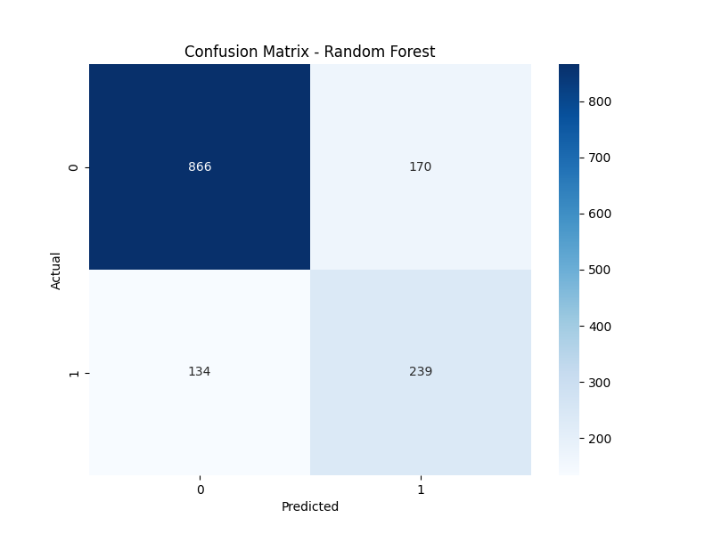
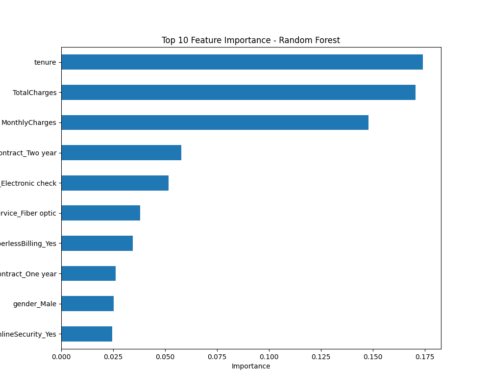

# Customer Churn Prediction
## Overview
Built a machine learning model to predict customer churn using the Telco Customer Churn dataset. Applied data preprocessing, trained Logistic Regression and Random Forest models with SMOTE, and visualized results. 

## Dataset
- Source: [Kaggle Telco Customer Churn](https://www.kaggle.com/datasets/blastchar/telco-customer-churn)
- Features: Tenure, TotalCharges, MonthlyCharges, Contract, etc.
- Target: Churn (Yes/No)

## Methodology
- Preprocessing: Handled missing values, encoded categorical variables, scaled numerical features.
- Models: Logistic Regression, Random Forest (with SMOTE).
- Evaluation: Accuracy, precision, recall, F1-score.
- Visualizations: Confusion matrix, feature importance.

## Results
- Random Forest: ~77-80% accuracy, recall ~0.64 for churn.
- Key predictors: Tenure, TotalCharges, MonthlyCharges, Contract types.

## Visualizations



## Setup
```bash
pip install -r requirements.txt
jupyter notebook Customer Churn Prediction.ipynb